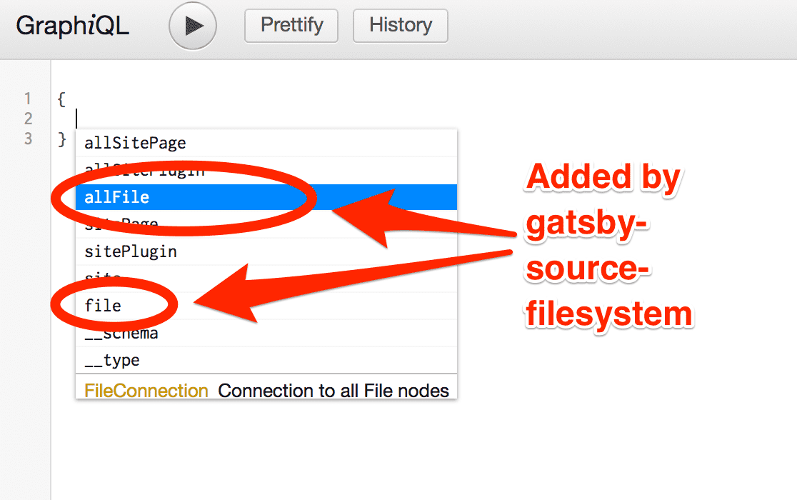
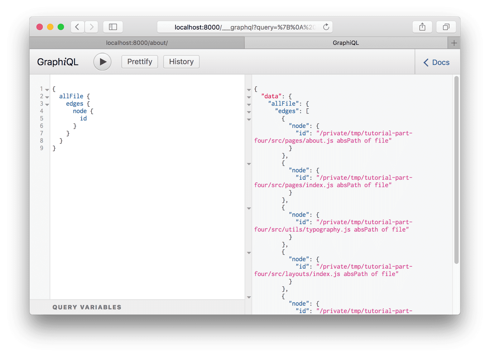
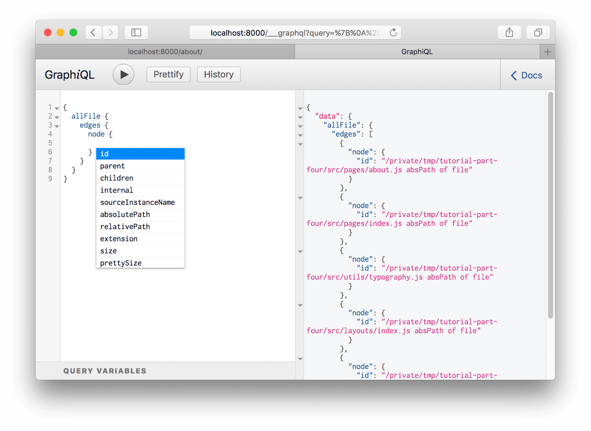
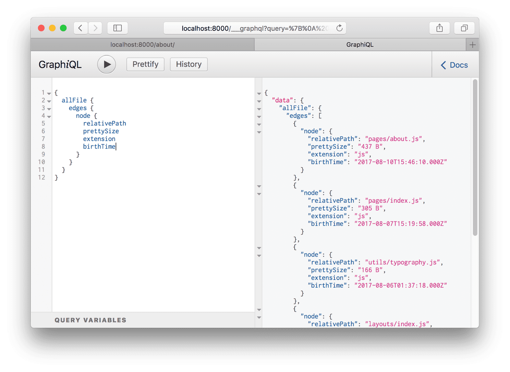
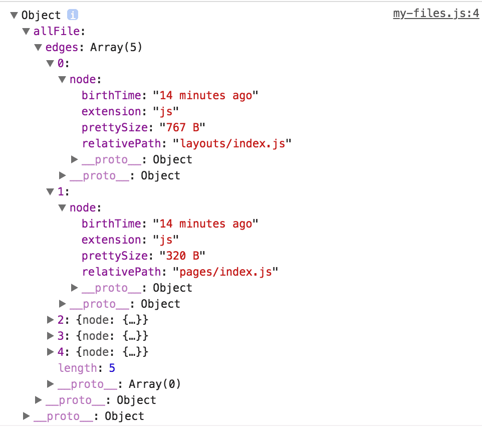
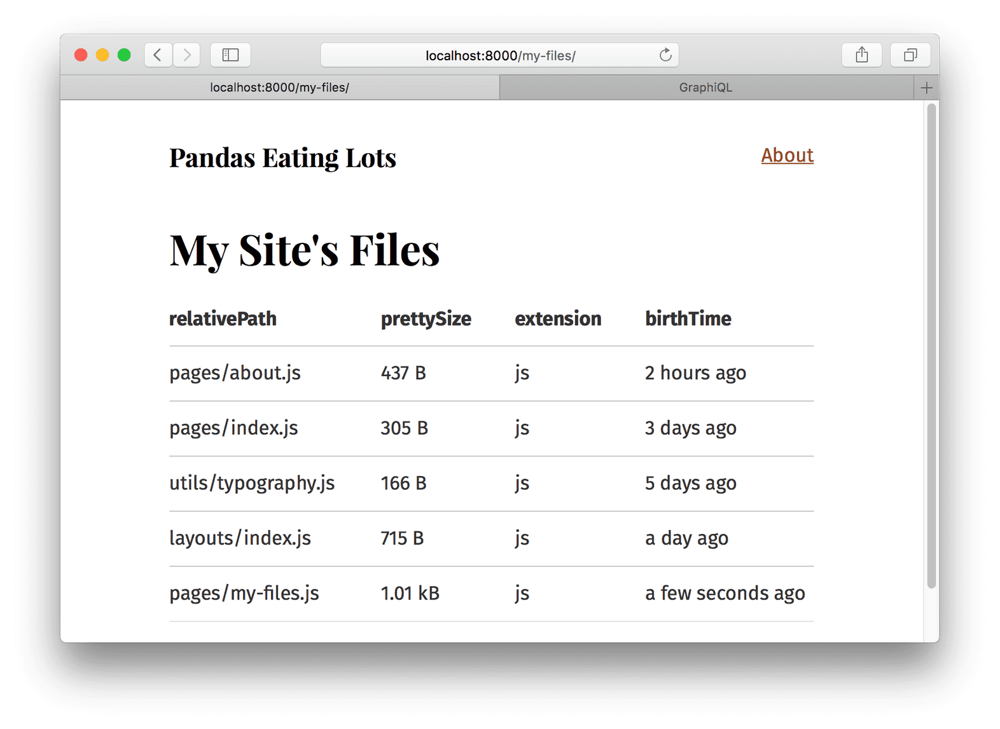

# [5. Source plugins and rendering queried data](https://www.gatsbyjs.org/tutorial/part-five/)

## What's in this tutorial?

이 튜토리얼에서는 GraphQL과 source 플러그인들을 이용해 Gatsby 사이트로 데이터를 불러오는 방법을 배울 것이다. 이런 플러그인들을 배우기 전에 Graph*i*QL이라고 불리는 당신의 쿼리들을 올바르게 구조화할 수 있도록 도와주는 툴에 대해 알고 싶을 것이다.

## Introduction Graph*i*QL

Graph*i*QL은 GrapheQL IDE(Integrated Development Environment)이며, Gatsby 사이트를 만들면서 자주 사용할 강력한(여러 면에서 놀라운) 툴이다.

사이트의 개발 서버가 실행되고 있는 동안에는 *일반적으로* [http://localhost:8000/___graphql](http://localhost:8000/___graphql) 주소로 접속할 수 있다.

여기 내장된 `site` 를 입력해서 거기에 어떤 필드들이 가능한지 보자 - 이미 질의했던 `siteMetadata` 객체를 포함해서. Graph*i*QL을 열어서 당신의 데이터로 이것 저것 해보자! *Ctrl + Space*(혹은 대체키로 *Shift + Space*)를 눌러 자동 완성 팝업을 띄우고 *Ctrl + Enter*를 입력해 GraphQL 쿼리를 실행해보자. 나머지 튜토리얼에서 Graph*i*QL을 더 많이 사용하게 될 것이다.

## Source Plugins

Gatsby 사이트의 데이터는 어디에서든 올 수 있다: APIs, databases, CMSs, local files, etc.

Source plugins은 그들의 소스로부터 데이터를 가져 온다. 즉, 파일 시스템 source plugin은 어떻게 파일 시스템에서 데이터를 가져오는지 안다. WordPress 플러그인도 어떻게 WordPress API를 통해 데이터를 가져오는지 안다.

`gatsby-source-filesystem`을 추가하고 어떻게 동작하는지 알아보자.

첫번째로 프로젝트의 루트에서 플러그인을 설치하자.

```bash
npm install --save gatsby-source-filesystem
```

그리고 *gatsby-config.js* 파일에 추가하자.

```javascript
module.exports = {
  siteMetadata: {
    title: `Pandas Eating Lots`,
  },
  plugins: [
    {
      resolve: `gatsby-source-filesystem`,
      options: {
        name: `src`,
        path: `${__dirname}/src/`
      }
    },
    `gatsby-plugin-emotion`,
    {
      resolve: `gatsby-plugin-typography`,
      options: {
        pathToConfigModule: `src/utils/typography`,
      },
    },
  ],
}
```

저장하고 개발 서버를 재시작하자. 그리고 Graph*i*QL을 다시 열어보자.

자동 완성 팝업을 띄우면, `gatsby-source-filesystem`이 추가한 `allFile`과 `file`을 보게 될 것이다.



`allFile`에서 *Enter*를 치고 *Ctrl + Enter*를 입력해 쿼리를 실행해보자



쿼리에서 `id`를 삭제하고 다시 자동 완성 팝업을 띄워보자 (*Ctrl + Space*)



몇 가지의 필드들을 쿼리에 추가하며 *Ctrl + Enter*를 입력해 쿼리를 매번 재실행해보자. 이것과 비슷한 화면을 보게 될 것:



결과는 파일 *"nodes"*(node는 *"graph"* 내부 객체의 fancy한 이름!) 의 목록이다. 각각의 파일 객체는 당신이 쿼리했던 필드들이 있다.

## Build a page with a GraphQL query

Gatsby에서 새로운 페이지를 만드는 것은 종종 Graph*i*QL에서 시작된다. 먼저 데이터 질의문을 Graph*i*QL에서 그려보고 UI를 만들기 위해 이걸 React page component에 복사한다.

한 번 해보자.

방금 만든 `allFile` GraphQL 쿼리와 함께 *src/pages/my-files.js* 파일을 만들자.

```javascript
import React from "react"
import { graphql } from "gatsby"
import Layout from "../components/layout"

export default ({ data }) => {
  console.log(data)
  return (
    <Layout>
      <div>Hello world</div>
    </Layout>
  )
}

export const query = graphql`
  query {
    allFile {
      edges {
        node {
          relativePath
          prettySize
          extension
          birthTime(fromNow: true)
        }
      }
    }
  }
`
```

위의 `console.log(data)` 라인을 보자. 새로운 component를 만들 때 GraphQL 쿼리로부터 얻은 데이터를 콘솔에 찍어보는 건 종종 도움이 된다. UI를 만드는 동안 브라우저의 콘솔에서 데이터를 파악할 수 있다.

*/my-files/* 주소로 새로운 페이지에 접속하고 브라우저의 콘솔을 열면 이런 걸 볼 수 있을 것:



데이터의 구조는 GraphQL 쿼리의 구조와 일치한다.

파일 데이터를 출력하기 위해 약간의 코드를 component에 추가하자.

```javascript
import React from "react"
import { graphql } from "gatsby"
import Layout from "../components/layout"

export default ({ data }) => {
  console.log(data)
  return (
    <Layout>
      <div>
        <h1>My Site's Files</h1>
        <table>
          <thead>
            <tr>
              <th>relativePath</th>
              <th>prettySize</th>
              <th>extension</th>
              <th>birthTime</th>
            </tr>
          </thead>
          <tbody>
            {data.allFile.edges.map(({node}, index) => (
              <tr key={index}>
                <td>{node.relativePath}</td>
                <td>{node.prettySize}</td>
                <td>{node.extension}</td>
                <td>{node.birthTime}</td>
              </tr>
            ))}
          </tbody>
        </table>
      </div>
    </Layout>
  )
}

export const query = graphql`
  query {
    allFile {
      edges {
        node {
          relativePath
          prettySize
          extension
          birthTime(fromNow: true)
        }
      }
    }
  }
`
```

그리고...😲

