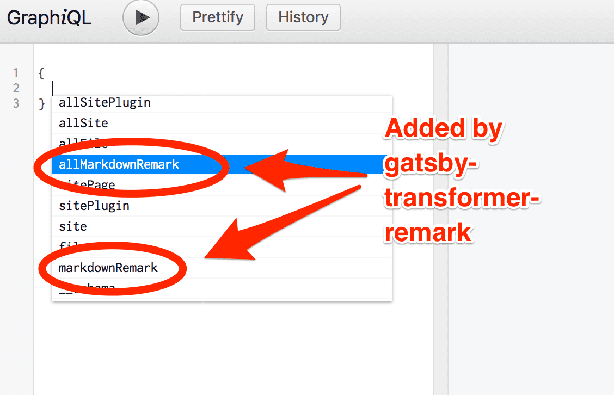
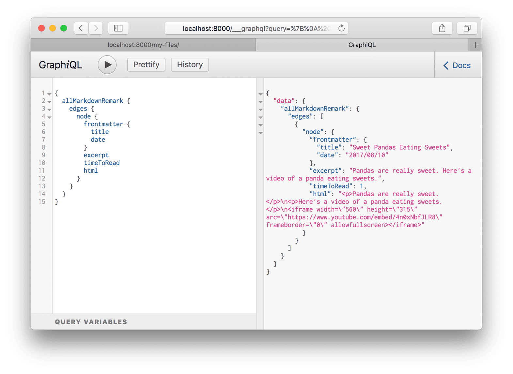
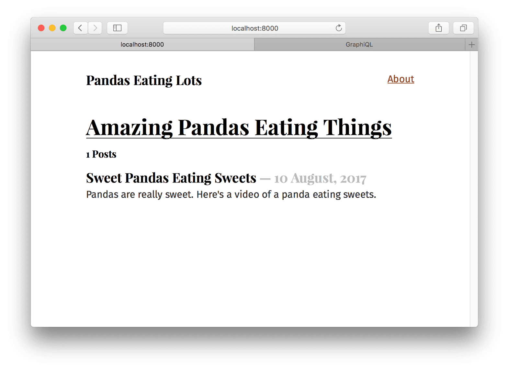
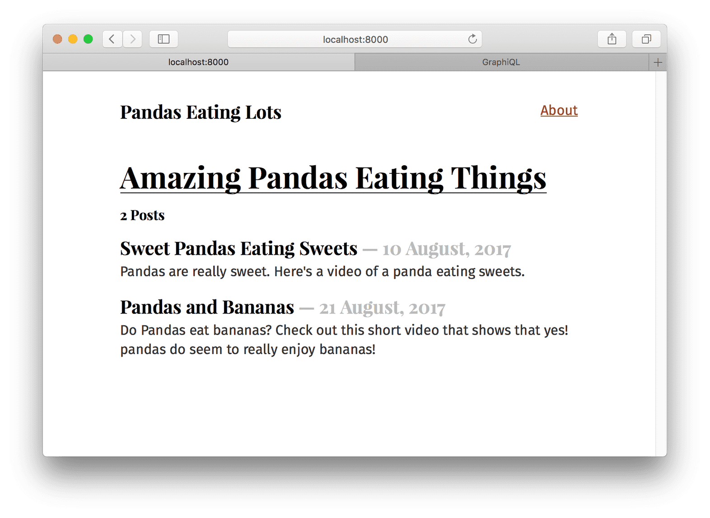

# [6. Transformer plugins](https://www.gatsbyjs.org/tutorial/part-six/)

## What's in this tutorial?

이전 튜토리얼은 어떻게 source plugin이 데이터를 Gatsby의 데이터 시스템으로 가져오는지 보여줬다. 이번 튜토리얼에서는 transformer plugin이 source plugin이 가져온 raw content를 어떻게 *변환* 하는지 배울 것이다. source plugins와 transformer plugins의 조합은 Gatsby 사이트를 구축할 때 필요할 수 있는 모든 데이터 sourcing과 transformation을 처리할 수 있다.

## Transformer plugins

종종, source plugin에서 얻은 데이터의 포맷은 당신이 웹사이트를 만드는 데 사용하길 원하는 형태가 아닐 것이다. 파일 시스템 source plugin은 파일들에 대한 질의를 하게 해주었지만, 만약 당신이 파일들의 내부 데이터에 대한 질의를 하고 싶다면?

이걸 가능하게 하기 위해, Gatsby는 source plugin에서 raw content를 받아 더 사용할만한 것으로 *변환*하는 transformer plugin을 지원한다.

마크다운 파일들을 예로 들어보자. 마크다운은 글을 작성할 때는 좋지만 그것으로 페이지를 만들 때는 마크다운이 HTML이 되어야 한다.

마크다운 파일을 사이트의 *src/pages/sweet-pandas-eating-sweets.md*에 추가하자. (이건 첫번째 마크다운 블로그 포스트가 될 것) 그리고 어떻게 그것을 transformer plugins과 GraphQL을 이용해 HTML로 변환하는지 배워보자.

```markdown
---
title: "Sweet Pandas Eating Sweets"
date: "2017-08-10"
---

Pandas are really sweet.

Here's a video of a panda eating sweets.

<iframe width="560" height="315" src="https://www.youtube.com/embed/4n0xNbfJLR8" frameborder="0" allowfullscreen></iframe>
```

파일을 저장하고, */my-files/* 를 다시 보자 - 새로운 마크다운 파일이 테이블에 있다. 이건 Gatsby의 매우 강력한 기능이다. 이전의 `siteMetadata` 예제처럼, source plugin은 데이터를 실시간으로 다시 불러올 수 있다. `gatsby-source-filesystem`은 항상 추가될 새로운 파일을 검색하며, 그럴 때마다 당신의 질의를 재실행한다.

마크다운 파일들을 변환할 수 있는 transformer plugin을 추가하자:

```bash
npm install --save gatsby-transformer-remark
```

그리고 평소처럼 *gatsby-config.js* 파일에 추가하자:

```javascript
module.exports = {
  siteMetadata: {
    title: `Pandas Eating Lots`,
  },
  plugins: [
    {
      resolve: `gatsby-source-filesystem`,
      options: {
        name: `src`,
        path: `${__dirname}/src/`
      }
    },
    `gatsby-transformer-remark`,
    `gatsby-plugin-emotion`,
    {
      resolve: `gatsby-plugin-typography`,
      options: {
        pathToConfigModule: `src/utils/typography`,
      },
    },
  ],
}
```

개발 서버를 재시작하고 Graph*i*QL을 새로고침(혹은 새로 열기)한 후 자동 완성 팝업을 보자:



다시 `allMarkdownRemark`를 선택하고 `allFile`에서 했던 것처럼 실행하자. 최근에 추가했던 마크다운 파일을 보게 될 것이다. `MarkdownRemark` 노드에서 사용 가능한 필드들을 탐색해보자.



OK! 몇 가지 기본적인 것들이 희망적으로 제자리를 찾기 시작했다. source plugin은 데이터를 Gatsby의 데이터 시스템으로 *가져오고* transformer plugin은 source plugin이 가져온 raw content를 *변환한다.* 이 패턴은 Gatsby 사이트를 만들 때 필요할 모든 데이터 sourcing과 데이터 transformation을 다룰 수 있다.

## Create a list of your site's markdown files in *src/pages/index.js*

이제 마크다운 파일들의 목록을 첫 페이지에 만들어야 한다. 많은 블로그들처럼, 첫페이지에 각 블로그 포스트를 가리키는 링크들의 목록을 만들고 싶을 것이다. 블로그의 마크다운 포스트들의 현재 목록은 GraphQL을 이용해 질의할 수 있으므로 목록을 따로 유지 보수할 필요가 없다.

*src/pages/my-files.js* 페이지처럼, 몇 가지 초기 HTML 그리고 스타일과 함께 GraphQL 쿼리를 추가하기 위해 *src/pages/index.js*를 아래 코드로 교체하자.

```javascript
import React from "react"
import { graphql } from "gatsby"
import { css } from "@emotion/core"
import { rhythm } from "../utils/typography"
import Layout from "../components/layout"

export default ({ data }) => {
  console.log(data)

  return (
    <Layout>
      <div>
        <h1 css={css`display: inline-block; border-bottom: 1px solid;`}>
          Amazing Pandas Eating Things
        </h1>
        <h4>{data.allMarkdownRemark.totalCount} Posts</h4>
        {data.allMarkdownRemark.edges.map(( { node }) => (
          <div key={node.id}>
            <h3 css={css`margin-bottom: ${rhythm(1 / 4)};`}>
              {node.frontmatter.title}{" "}
              <span css={css`color: #bbb;`}>
                - {node.frontmatter.date}
              </span>
            </h3>
            <p>{node.excerpt}</p>
          </div>
        ))}
      </div>
    </Layout>
  )
}

export const query = graphql`
  query {
    allMarkdownRemark {
      totalCount
      edges {
        node {
          id
          frontmatter {
            title
            date(formatString: "DD MMMM, YYYY")
          }
          excerpt
        }
      }
    }
  }
`
```

이제 첫페이지는 이렇게 보여야 한다:



하지만 블로그 포스트 하나는 좀 외로워 보인다 😥 *src/pages/pandas-and-bananas.md* 포스트 하나를 더 추가해보자.

```markdown
---
title: "Pandas and Bananas"
date: "2017-08-21"
---

Do Pandas eat bananas? Check out this short video that shows that yes! pandas do
seem to really enjoy bananas!

<iframe width="560" height="315" src="https://www.youtube.com/embed/4SZl1r2O_bY" frameborder="0" allowfullscreen></iframe>
```



좋아 보인다! 포스트의 순서가 잘못됐다는 것만 빼고...

하지만 이건 고치기 쉽다. 어떤 유형의 연결을 질의할 때, GraphQL 쿼리에 다양한 인자를 넘길 수 있다. 노드들을 `sort`하거나 `filter`할 수 있고, 몇 개의 노드들을 `skip`할지 정할 수 있고, 몇 개의 노드를 받아올지 `limit`를 선택할 수도 있다. 이 강력한 연산자들의 집합으로 원하는 어떤 데이터든지 필요한 포맷으로 선택할 수 있다.

index 페이지의 GraphQL쿼리에서 `allMarkdownRemark`를 `allMarkdownRemark(sort: {fields: [frontmatter___date], order: DESC})`로 변경하자. (`frontmatter`와 `date` 사이에는 3개의 underscore가 있다.) 저장하면 정렬 순서는 고쳐져야 한다.

Graph*i*QL을 열고 다른 정렬 옵션들을 시도해보자. `allFile`연결도 다른 연결들처럼 정렬할 수 있다.

질의 연산자에 대해 더 자세한 문서를 보려면, [GraphQL reference guide](https://www.gatsbyjs.org/docs/graphql-reference/)를 확인해보자

## Challenge

블로그 포스트를 포함하는 새로운 페이지를 만들고 홈페이지의 블로그 포스트 목록에 무슨 변화가 있는지 살펴보자!