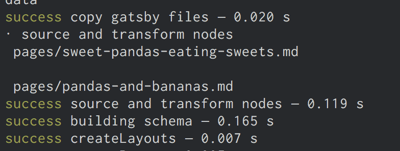
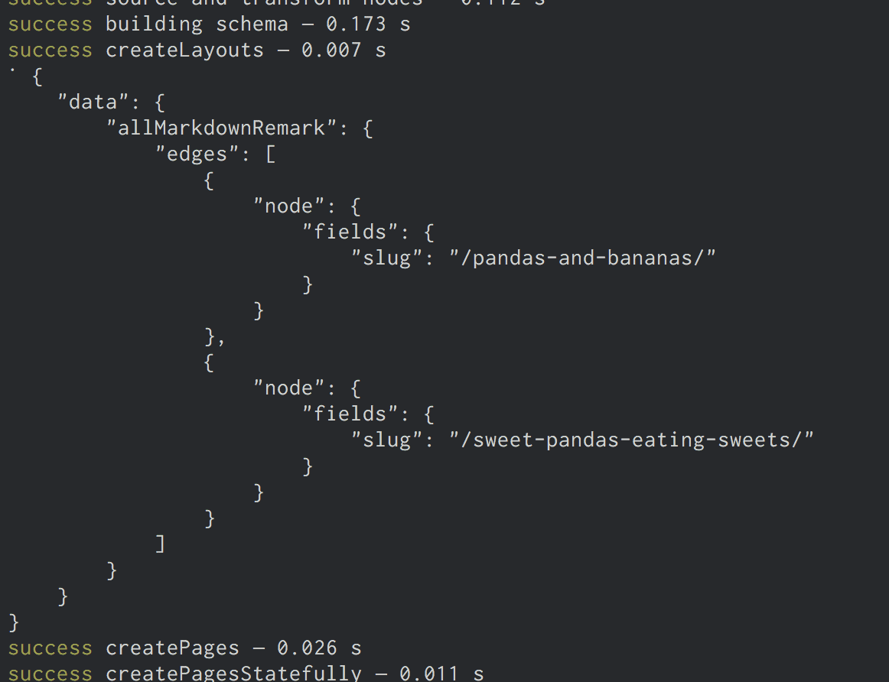
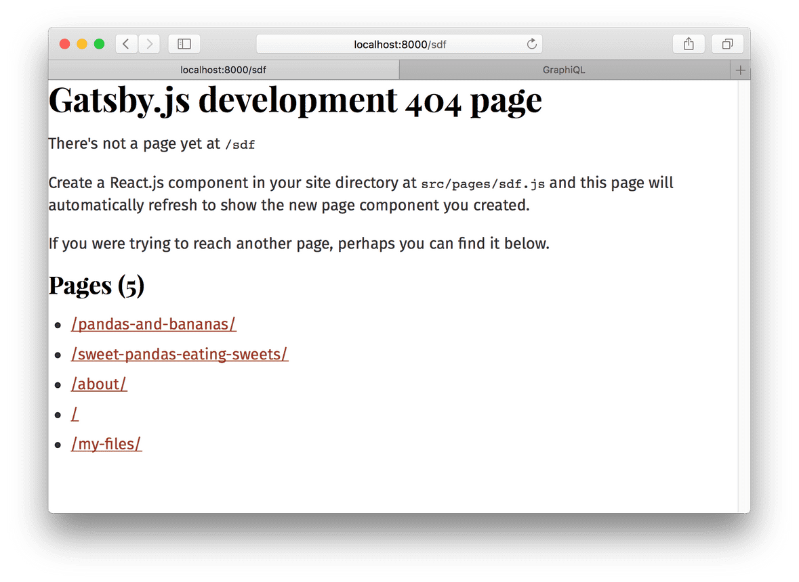
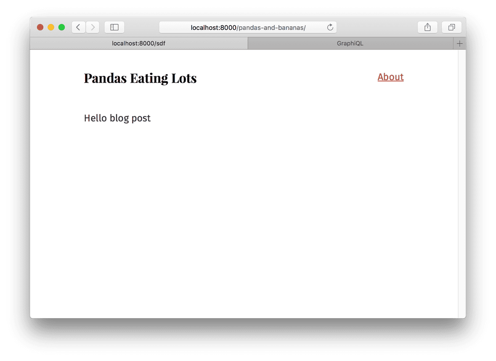

# [7. Programmatically create pages from data](https://www.gatsbyjs.org/tutorial/part-seven/)

## What's in this tutorial?

이전 튜토리얼에선 마크다운 파일들을 조회하고 블로그 포스트 제목과 발췌문의 목록을 만들어내는 멋진 인덱스 페이지를 만들었다. 하지만 단지 발췌문만 보기보단, 마크다운 파일들에 대한 실제 페이지들을 원할 것이다.

*src/pages*에 React component를 만들어서 계속해서 새로운 페이지를 만들 수 있다. 그러나 다음에는 어떻게 데이터에서 *프로그램적으로* 페이지를 만드는지 배울 것이다. Gatsby는 다른 정적 사이트 생성기처럼 파일들에서 페이지를 만드는 것이 제한되어 있지 않다. Gatsby는 빌드할 때 GraphQL을 사용해 데이터를 질의할 수 있게 하고, 질의 결과를 페이지와 연결한다. 이건 정말 강력한 아이디어다. 그것이 미치는 영향과 사용하는 방법을 이 튜토리얼에서 탐구해볼 것이다.

시작하자! 👻

## Creating slugs for pages

새로운 페이지를 만드는 건 두 단계를 가진다:

1. 페이지를 위해 "path"나 "slug"를 생성한다
2. 페이지를 만든다

Note: 종종 데이터 소스는 내용물을 위해 slug나 경로 이름을 바로 제공할 것이다. 이런 시스템과 작업할 때(즉 CMS), 마크다운 파일들처럼 slug를 직접 만들 필요가 없다.

마크다운 페이지들을 만들기 위해 2개의 Gatsby APIs `onCreateNode` 그리고 `createPages`를 배울 것이다. 이 두 개의 열심히 일하는 API가 많은 사이트들과 플러그인들에서 사용된다는 걸 보게 될 것이다.

우리는 Gatsby API를 구현하기 쉽게 하기 위해 최선을 다했다. API를 구현하기 위해, *gatsby-node.js*에서 API의 이름으로 함수를 export해야 한다.

여기서 그것을 할 것이다. 사이트의 최상위 디렉터리에서 *gatsby-node.js* 파일을 생성하자. 그리고 아래 코드를 추가하자.

```javascript
exports.onCreateNode = ({ node }) => {
  console.log(node.internal.type)
}
```

이 `onCreateNode` 함수는 새로운 노드가 생성(혹은 업데이트)될 때마다 Gatsby에 의해 호출될 것이다.

개발서버를 재시작하자. 상당수의 새로 생성된 노드들의 로그를 터미널 콘솔에서 보게 될 것이다.

이 API를 이용해 마크다운 페이지를 위한 slug를 `MarkdownRemark` 노드에 추가하자.

함수를 변경하면 `MarkdownRemark` 노드들만 로그에 나타날 것이다.

```javascript
exports.onCreateNode = ({ node }) => {
  if (node.internal.type === `MarkdownRemark`) {
    console.log(node.internal.type)
  }
}
```

페이지 slug를 만들기 위해 각각의 마크다운 파일 이름을 사용하고 싶을 것이다. 그러면 *pandas-and-bananas.md*는 */pandas-and-bananas/* 가 되겠지. 하지만 어떻게 `MarkdownRemark` 노드에서 파일 이름을 가져올 수 있을까? 파일 이름을 얻기 위해서 "node graph"에서 그 *부모* `File` 노드를 탐색할 필요가 있다. `File` 노드는 당신에게 필요한 디스크에 있는 파일들의 정보를 가지고 있다. 이걸 하기 위해 함수를 다시 수정하자:

```javascript
exports.onCreateNode = ({ node, getNode }) => {
  if (node.internal.type === `MarkdownRemark`) {
    const fileNode = getNode(node.parent)
    console.log(`\n`, fileNode.relativePath)
  }
}
```

터미널에서 두 개의 마크다운 파일들의 상대 경로들을 볼 수 있어야 한다.



이제 slugs를 생성해야만 한다. 파일 이름에서 slugs만드는 로직은 까다로울 수 있는데, *gatsby-source-filesystem* 플러그인은 slugs를 만들기 위한 함수를 가지고 있다. 그걸 사용해보자

```javascript
const { createFilePath } = require(`gatsby-source-filesystem`)

exports.onCreateNode = ({ node, getNode }) => {
  if (node.internal.type === `MarkdownRemark`) {
    console.log(createFilePath({ node, getNode, basePath: `pages` }))
  }
}
```

이 함수는 부모인 `File` 노드를 찾아내고 slug를 생성하는 걸 함께 처리한다. 개발 서버를 다시 시작하면, 터미널에 각 마크다운 파일마다 하나씩, 두 개의 slugs의 로그가 찍힌 것이 보여야 한다.

이제 새로운 slugs를 `MarkdownRemark` 노드들에 직접 추가할 수 있다. 이건 매우 강력한데, 노드들에 추가한 어떤 데이터든 나중에 GraphQL로 질의할 수 있기 때문이다. 그래서 페이지를 만들 때 slug를 가져오는 것이 쉬울 것이다.

그렇게 하기 위해, 우리의 API 구현에 전달된 `createNodeField`라고 불리는 함수를 사용할 것이다. 이 함수는 다른 플러그인들이 생성한 노드에 추가적인 필드들을 생성할 수 있게 한다. 오직 노드의 원본 생성자(original creator)만 노드를 직접 고칠 수 있다 - 모든 다른 플러그인들(*gatsby-node.js*를 포함해)이 추가적인 필드들을 생성하기 위해서는 반드시 이 함수를 사용해야 한다.

```javascript
const { createFilePath } = require(`gatsby-source-filesystem`)

exports.onCreateNode = ({ node, getNode, actions }) => {
const { createNodeField } = actions
  if (node.internal.type === `MarkdownRemark`) {
    const slug = createFilePath({ node, getNode, basePath: `pages` })
    createNodeField({
      node,
      name: `slug`,
      value: slug,
    })
  }
}
```

개발 서버를 재시작하고 Graph*i*QL을 열거나 새로고침 하자. 그리고 새로운 slugs를 확인하기 위해 이 GraphQL 쿼리를 실행하자.

```graphql
{
  allMarkdownRemark {
    edges {
      node {
        fields {
          slug
        }
      }
    }
  }
}
```

이제 slugs가 생성되었고, 페이지들을 만들 수 있다.

## Creating pages

같은 *gatsby-node.js* 파일에서 아래 내용을 추가하자

```javascript
const { createFilePath } = require(`gatsby-source-filesystem`)

exports.onCreateNode = ({ node, getNode, actions }) => {
  const { createNodeField } = actions
  if (node.internal.type === `MarkdownRemark`) {
    const slug = createFilePath({ node, getNode, basePath: `pages` })
    createNodeField({
      node,
      name: `slug`,
      value: slug,
    })
  }
}

exports.createPages = ({ graphql, actions }) => {
  // **Note:** The graphql function call returns a Promise
  // see: https://developer.mozilla.org/en-US/docs/Web/JavaScript/Reference/Global_Objects/Promise for more info
  return graphql(`
    {
      allMarkdownRemark {
        edges {
          node {
            fields {
              slug
            }
          }
        }
      }
    }
  `).then(result => {
    console.log(JSON.stringify(result, null, 4))
  })
}
```

플러그인이 페이지를 추가할 수 있도록 Gatsby가 호출하는 `createPages` API의 구현을 추가했다.

이번 파트의 튜토리얼 처음에 언급했듯이, 프로그램적으로 페이지를 만드는 단계는:

1. GraphQL로 데이터를 질의
2. 질의 결과를 페이지와 연결

생성했던 마크다운 slug를 질의하기 위해 제공된 `graphql` 함수를 사용했던 것은 마크다운 파일로부터 페이지를 생성하기 위한 첫번째 단계이다. 그리고 질의문의 결과 로그는 이것처럼 보여야 한다:



페이지를 생성하기 위해서는 slug외에도 하나가 더 필요하다: page template component. Gatsby의 다른 모든 것들처럼, 프로그램으로 만드는 페이지들은 React component에 의해 작동한다. 페이지를 만들 때, 어떤 component를 사용할지 정해야 한다.

*src/templates* 디렉터리를 만들고, *src/templates/blog-post.js* 파일에 아래 코드를 추가하자.

```javascript
import React from "react"
import Layout from "../components/layout"

export default () => {
  return (
    <Layout>
      <div>Hello blog post</div>
    </Layout>
  )
}
```

그리고 *gatsby-node.js*를 업데이트

```javascript
const path = require(`path`)
const { createFilePath } = require(`gatsby-source-filesystem`)

exports.onCreateNode = ({ node, getNode, actions }) => {
  const { createNodeField } = actions
  if (node.internal.type === `MarkdownRemark`) {
    const slug = createFilePath({ node, getNode, basePath: `pages` })
    createNodeField({
      node,
      name: `slug`,
      value: slug,
    })
  }
}

exports.createPages = ({ graphql, actions }) => {
  // **Note:** The graphql function call returns a Promise
  // see: https://developer.mozilla.org/en-US/docs/Web/JavaScript/Reference/Global_Objects/Promise for more info
  const { createPage } = actions
  return graphql(`
    {
      allMarkdownRemark {
        edges {
          node {
            fields {
              slug
            }
          }
        }
      }
    }
  `).then(result => {
    result.data.allMarkdownRemark.edges.forEach(({ node }) => {
      createPage({
        path: node.fields.slug,
        component: path.resolve(`./src/templates/blog-post.js`),
        context: {
          // Data passed to context is available
          // in page queries as GraphQL variables.
          slug: node.fields.slug
        }
      })
    })
  })
}
```

개발 서버를 재시작하면 페이지들이 생성되었을 것이다! 개발하면서 새로 생성한 페이지를 찾는 쉬운 방법은 Gatsby가 사이트 페이지의 목록을 보여주는 임의의 경로로 접속하는 것이다. 만약 [http://localhost:8000/sdf](http://localhost:8000/sdf) 로 접속하면 생성했던 새로운 페이지들을 볼 것이다.



목록 중의 하나를 방문해보면 이런 게 보이겠지:



좀 지루하고, 원하는 것이 아냐 😡 이제 마크다운 포스트에서 데이터를 당겨올 수 있다. *src/templates/blog-posts.js*를 바꾸자:

```javascript
import React from "react"
import { graphql } from "gatsby"
import Layout from "../components/layout"

export default ({ data }) => {
  const post = data.markdownRemark
  return (
    <Layout>
      <h1>{post.frontmatter.title}</h1>
      <div dangerouslySetInnerHTML={{ __html: post.html }} />
    </Layout>
  )
}

export const query = graphql`
  query($slug: String!) {
    markdownRemark(fields: { slug: { eq: $slug }}) {
      html
      frontmatter {
        title
      }
    }
  }
`
```

그리고...

[](https://www.notion.so/54abc15d4895426aa671fe937fab47a0#b668151a170c4c8bbabb5e144bb6369d)

꺅 🎉

마지막 단계는 인덱스 페이지에서 새로운 페이지로 링크를 거는 것이다.

*src/pages/index.js*로 돌아가서 마크다운 slugs를 질의하고 링크를 만들자.

```javascript
import React from "react"
import { Link, graphql } from "gatsby"
import { css } from "@emotion/core"
import { rhythm } from "../utils/typography"
import Layout from "../components/layout"

export default ({ data }) => {
  console.log(data)

  return (
    <Layout>
      <div>
        <h1 css={css`display: inline-block; border-bottom: 1px solid;`}>Amazing Pandas Eating Things</h1>
        <h4>{data.allMarkdownRemark.totalCount} Posts</h4>
        {data.allMarkdownRemark.edges.map(( { node }) => (
          <div key={node.id}>
            <Link to={node.fields.slug}
                  css={css`
                    text-decoration: none;
                    color: inherit;`}>
              <h3 css={css`margin-bottom: ${rhythm(1 / 4)};`}>
                {node.frontmatter.title}{" "}
                <span css={css`color: #bbb;`}>
                  - {node.frontmatter.date}
                </span>
              </h3>
              <p>{node.excerpt}</p>
            </Link>
          </div>
        ))}
      </div>
    </Layout>
  )
}

export const query = graphql`
  query {
    allMarkdownRemark(sort: { fields: [frontmatter___date], order: DESC }) {
      totalCount
      edges {
        node {
          id
          frontmatter {
            title
            date(formatString: "DD MMMM, YYYY")
          }
          fields {
            slug
          }
          excerpt
        }
      }
    }
  }
`
```

이제 봐! 비록 작지만 작동하는 블로그다!