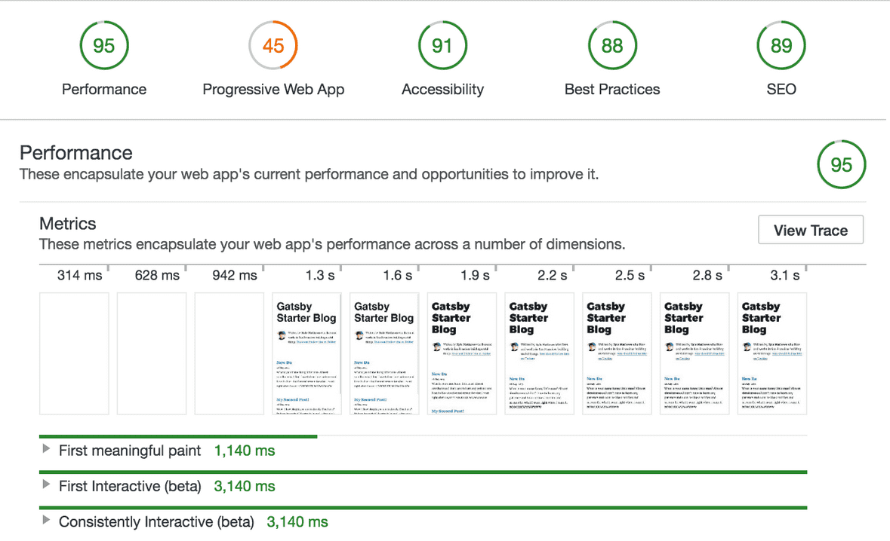

# [8. Preparing a site to go live](https://www.gatsbyjs.org/tutorial/part-eight/)

먼 길을 왔어! 그동안 이런 것들을 배웠지:

- 새로운 Gatsby 사이트 생성하기
- 페이지와 컴포넌트 생성하기
- 스타일 컴포넌트
- 사이트에 플러그인 추가하기
- source & transform data
- 페이지를 위한 데이터를 질의하기 위해 GraphQL을 사용하기
- 데이터에서 프로그램적으로 페이지 생성하기

이번 마지막 섹션에서는 [Lighthouse](https://developers.google.com/web/tools/lighthouse/)라는 강력한 사이트 진단 도구를 도입해 사이트를 가동 준비를 위한 몇 가지 일반적인 단계를 거칠 거야. 그 도중에 Gatsby 사이트에서 사용하길 원하게 될 몇 가지 플러그인을 더 소개할거야.

## Audit with Lighthouse

[Lighthouse website](https://developers.google.com/web/tools/lighthouse/)에서 인용:

> Lighthouse는 오픈 소스로 웹 페이지의 질을 끌어올리기 위한 자동화 툴이다. 공개 또는 인증이 필요한 어떤 웹 페이지에 붙여 실행할 수 있다. 성능, 접근성, progressive web apps(PWAs) 등등에 대한 검사를 할 수 있다.

Lighthouse는 크롬 DevTools에 포함되어 있다. 검사를 실행 - 그리고 그것이 발견한 오류를 해결하고 그것이 제안한 개선 사항을 구현 - 하는 것은 사이트를 가동하기 위해 준비하는 좋은 방법이다. 그것은 당신의 사이트가 충분히 빠르고 접근성이 좋다는 확신을 준다.

시도해보자!

첫번째로 Gatsby 사이트의 production 빌드를 생성해야 한다. Gatsby 개발 서버는 개발을 빠르게 하기 위해 최적화되어 있다; 그러나 그것이 생성한 사이트는 production 버전과 유사하긴 하지만 그렇게 최적화되어 있지는 않다.

### Create a production build

1. 개발 서버를 멈추고 (만약 아직 실행되고 있다면) 아래 명령어를 실행:

    ```bash
    gatsby build
    ```

    💡 파트 1에서 배웠듯이 이건 당신 사이트의 production 빌드를 수행하고 *public* 디렉터리에 빌드된 정적 파일들을 저장한다

2. production 사이트를 로컬에서 보자. 실행:

    ```bash
    gatsby serve
    ```

    시작하면, *[localhost:9000](http://localhost:9000)* 에서 사이트를 볼 수 있다.

### Run a Lighthouse audit

이제 첫 번째 Lighthouse 검사를 실행할 것

1. 아직 하지 않았다면, 테스트를 방해하는 extensions이 없도록 크롬을 Incognito 모드로 열자. 그리고 크롬 DevTools를 열자.
2. "Audits" 탭을 클릭하자
3. "Perform an audit..."을 클릭(모든 검사 가능한 유형들이 기본적으로 선택되어 있어야 한다). 그리고 "Run audit"을 클릭. (검사를 수행하는 데 1분 정도 걸릴 것) 한 번 검사가 완료되면, 이것과 비슷한 결과를 보게 될 것:



보다시피, Gatsby의 성능은 매우 훌륭하지만 점수를 향상시킬 PWA, 접근성, Best Practices 그리고 SEO에 대한 몇 가지를 놓치고 있다. (그리고 그 과정에서 사이트를 방문자들과 검색 엔진에 더 프렌들리하게 만들 것이다)

## Add a manifest file

"Progressive Web App" 카테고리에서 부진한 점수를 얻은 것처럼 보인다. 이걸 다뤄보자

하지만 먼저, *PWAs가 대체 뭐지?*

그들은 앱과 같은 특징과 편의성으로 웹 경험을 향상시키기 위해 최신 브라우저 기능을 이용하는 일반적인 웹사이트들이다. 무엇이 PWA 경험을 정의하는지 [Google's overview](https://developers.google.com/web/progressive-web-apps/)를 확인해보자.

Web app manifest 포함은 일반적으로 받아들여지는 [PWA의 기준 요건](https://alistapart.com/article/yes-that-web-project-should-be-a-pwa#section1) 세 가지 중 하나이다.

[Google](https://developers.google.com/web/fundamentals/web-app-manifest/)을 인용:

> 웹 앱 매니페스트는 당신의 웹 애플리케이션에 대한 것, 그리고 사용자의 모바일 기기나 데스크탑에 *'설치'*되었을 때 어떻게 행동해야 하는지를 브라우저에게 얘기하는 간단한 JSON 파일이다.

[Gatsby's manifest plugin](https://www.gatsbyjs.org/packages/gatsby-plugin-manifest/)은 Gatsby가 *manifest.webmanifest* 파일을 매 사이트 빌드마다 생성하도록 설정한다.

### Using `gatsby-plugin-manifest`

1. 플러그인 설치:

    ```bash
    npm install --save gatsby-plugin-manifest
    ```

2. 앱을 위해 *src/images/icon.png* 에 favicon 추가. 아이콘은 manifest를 위한 모든 이미지를 빌드하는 데 필요하다. 더 자세히 알고 싶으면 [gatsby-plugin-manifest](https://github.com/gatsbyjs/gatsby/blob/master/packages/gatsby-plugin-manifest/README.md) 보기
3. *gatsby-config.js* 파일의 `plugins` 목록에 플러그인 추가

    ```javascript
    {
      plugins: [
        {
          resolve: `gatsby-plugin-manifest`,
          options: {
            name: "GatsbyJS",
            short_name: "GatsbyJS",
            start_url: "/",
            background_color: "#6b37bf",
            theme_color: "#6b37bf",
            // Enables "Add to Homescreen" prompt and disables browser UI (including back button)
            // see https://developers.google.com/web/fundamentals/web-app-manifest/#display
            display: "standalone",
            icon: "src/images/icon.png", // This path is relative to the root of the site.
          },
        },
      ]
    }
    ```

    Gatsby 사이트에 웹 매니페스트를 추가하기 위해 필요한 건 이게 다다. 주어진 예제는 기본 설정을 나타낸다. 더 많은 옵션을 보려면 [plugin reference](https://www.gatsbyjs.org/packages/gatsby-plugin-manifest/?=gatsby-plugin-manifest#automatic-mode)를 확인해보자.

## Add offline support

웹 사이트가 PWA의 자격을 갖추기 위한 또 다른 요건은 [service worker](https://developer.mozilla.org/en-US/docs/Web/API/Service_Worker_API)의 사용이다. service worker는 백그라운드에서 동작하며, 연결 상태에 따라 네트워크나 캐쉬된 컨텐트를 서비스 하기로 결정하여, 원활하고 잘 관리된 오프라인 경험을 허락한다.

[Gatsby's offline plugin](https://www.gatsbyjs.org/packages/gatsby-plugin-offline/)은 Gatsby 사이트를 오프라인에서 작동하게 하고, 사이트를 위한 service worker를 만들어냄으로써 나쁜 네트워크 조건에 대해 더 저항적(resistant)이다.

### Using `gatsby-plugin-offline`

1. 플러그인 설치:

    ```bash
    npm install --save gatsby-plugin-manifest
    ```

2. *gatsby-config.js* 파일의 `plugins` 목록에 플러그인 추가

    ```javascript
    {
        plugins: [
            {
                resolve: `gatsby-plugin-manifest`,
                options: {
                    ...
                }
            },
            'gatsby-plugin-offline'
        ]
    }
    ```

service worker를 Gatsby와 함께 사용하기 위해 필요한 건 이게 다다.

💡 오프라인 플러그인이 생성된 *manifest.webmanifest* 파일을 캐쉬할 수 있도록 매니페스트 플러그인을 반드시 오프라인 플러그인 *앞에* 위치해야 한다.

## Add page metadata

페이지에 메타데이터 추가(제목이나 설명같은 것)는 구글 같은 검색 엔진이 당신의 컨텐트를 이해할 수 있도록 돕고, 언제 그것을 검색 결과들에 반영할지 결정하는 데 도움을 준다.

[React Helmet](https://github.com/nfl/react-helmet)은 [document head](https://developer.mozilla.org/en-US/docs/Web/HTML/Element/head)를 관리할 수 있도록 React component 인터페이스를 제공하는 패키지이다.

Gatsby의 react helmet plugin은 React Helmet에서 추가된 데이터를 서버 렌더링 데이터에 대한 즉각적인 지원을 제공한다. React Helmet에 추가한 속성들은 플러그인을 사용해서 Gatsby가 빌드하는 정적 HTML 페이지들에 추가될 것이다.

### Using React Helmet and `gatsby-plugin-react-helmet`

1. 패키지 둘 다 설치

    ```bash
    npm install --save gatsby-plugin-react-helmet react-helmet
    ```

2. *gatsby-config.js* 파일의 `plugins` 목록에 플러그인 추가

    ```javascript
    {
      plugins: [`gatsby-plugin-react-helmet`]
    }
    ```

3. 페이지에서 React Helmet 사용:

    ```javascript
    import React from "react"
    import { Helmet } from "react-helmet"
    
    class Application extends React.Component {
      render() {
        return (
          <div className="application">
            // 여기부터
            <Helmet>
              <meta charSet="utf-8" />
              <title>My Title</title>
              <link rel="canonical" href="http://mysite.com/example" />
            </Helmet>
            ...
            // 여기까지
          </div>
        )
      }
    }
    ```

위의 예제는 [React Helmet docs](https://github.com/nfl/react-helmet#example)에서 가져온 것. 더 자세히 알아봐!

## Keep making it better

이번 섹션에선 사이트의 성능을 향상시키고 가동을 준비하기 위한 몇 가지 Gatsby 특징적인 툴들을 보여줬다.

Lighthouse는 사이트를 향상시키고 학습하기 위한 멋진 툴이다 - 그것이 제공하는 상세한 피드백을 계속해서 살펴보고 사이트를 계속해서 낫게 만들자!